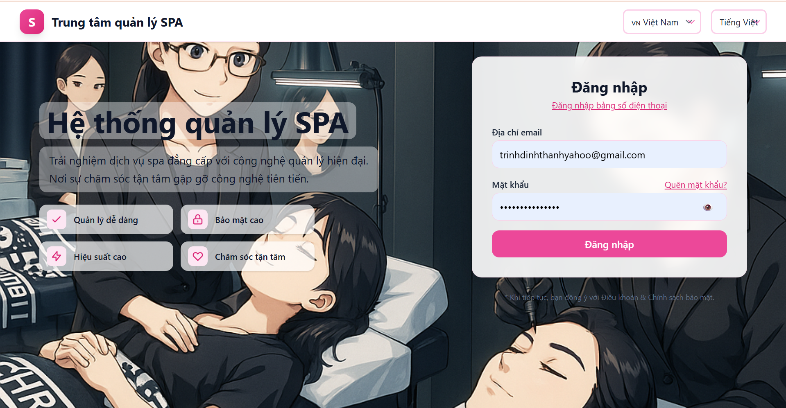
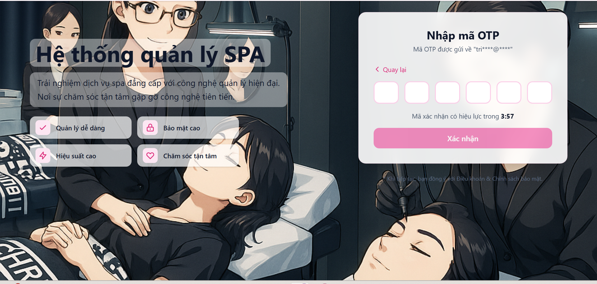
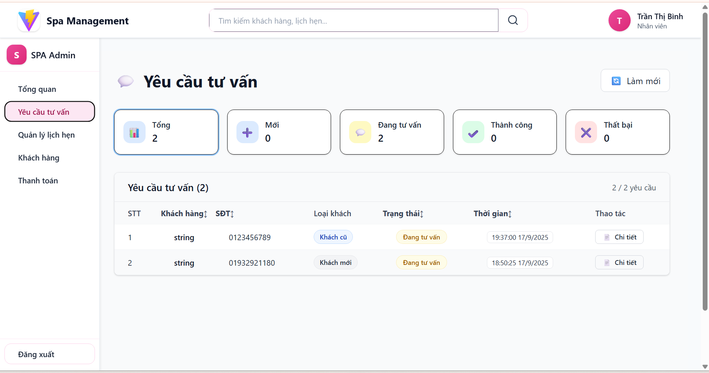
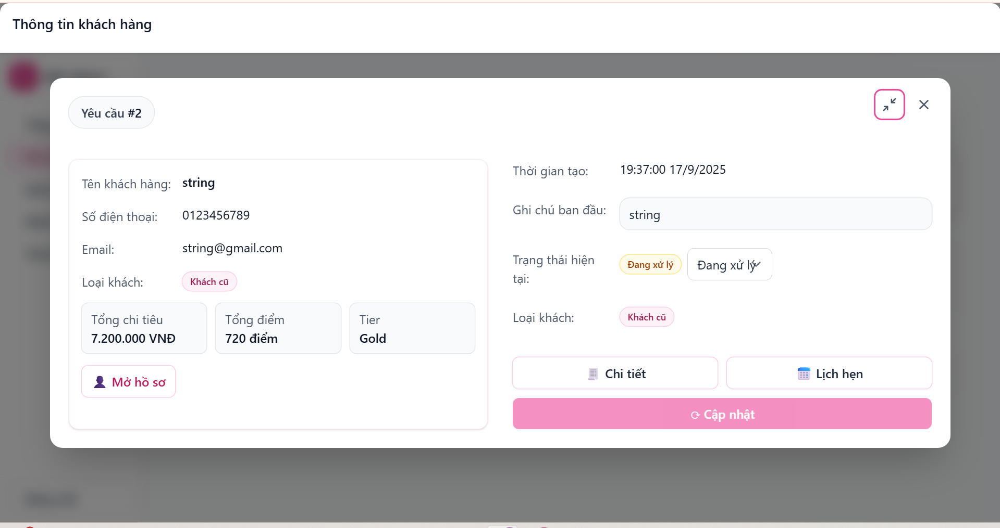
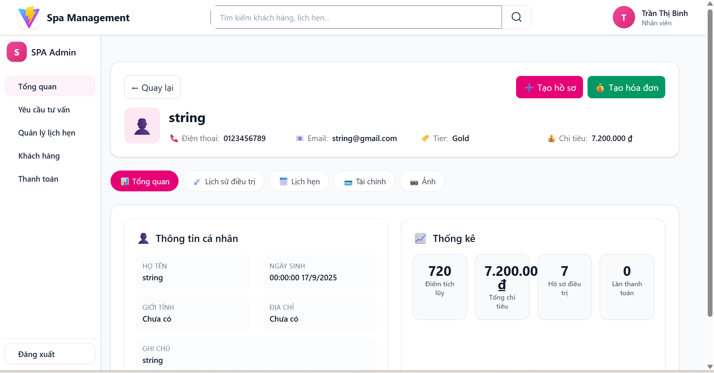
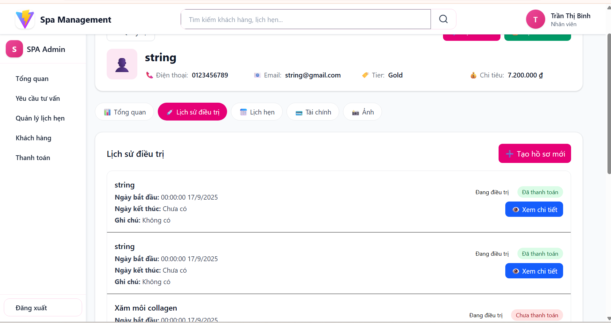
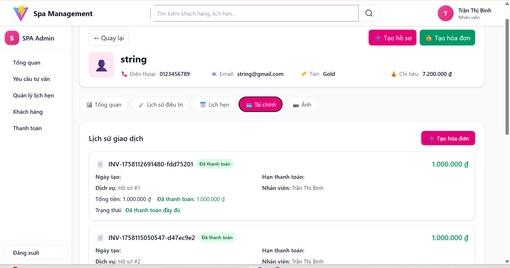
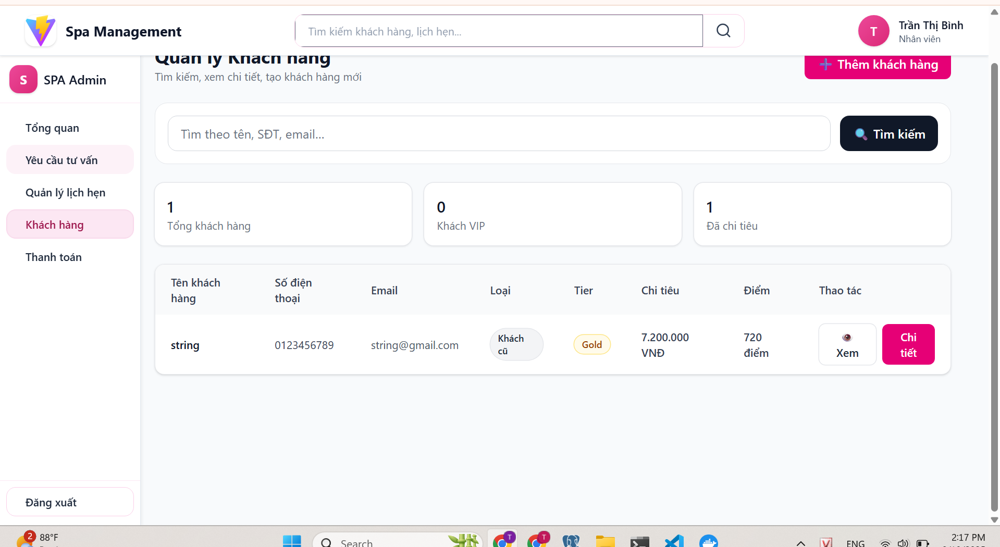

# Hệ thống Quản lý SPA

Hệ thống quản lý spa đẳng cấp với công nghệ quản lý hiện đại.

---

## Giao diện ứng dụng

### 1. Trang đăng nhập
  
Giao diện đăng nhập với form nhập email và mật khẩu.

### 2. Xác thực OTP
  
Trang nhập mã OTP để xác thực đăng nhập.

### 3. Dashboard yêu cầu tư vấn
  
Trang quản lý các yêu cầu tư vấn từ khách hàng.

### 4. Chi tiết yêu cầu khách hàng
  
Modal hiển thị thông tin chi tiết yêu cầu tư vấn của khách hàng.

### 5. Thông tin khách hàng
  
Trang hiển thị tổng quan thông tin cá nhân của khách hàng.

### 6. Lịch sử điều trị
  
Trang quản lý lịch sử các dịch vụ điều trị của khách hàng.

### 7. Lịch sử giao dịch
  
Trang theo dõi lịch sử thanh toán và hóa đơn của khách hàng.

### 8. Quản lý khách hàng
  
Danh sách tổng quan và quản lý thông tin khách hàng.

---

## Công nghệ sử dụng

- **React + Vite**
- **Tailwind CSS**
- **Modern UI/UX Design**

> Template cung cấp cấu hình tối thiểu để khởi chạy React với Vite, hỗ trợ HMR và một số quy tắc ESLint cơ bản.

Hiện tại có hai plugin chính thức:

- [@vitejs/plugin-react](https://github.com/vitejs/vite-plugin-react/blob/main/packages/plugin-react) sử dụng [Babel](https://babeljs.io/) cho Fast Refresh  
- [@vitejs/plugin-react-swc](https://github.com/vitejs/vite-plugin-react-swc) sử dụng [SWC](https://swc.rs/) cho Fast Refresh  

---

## Mở rộng cấu hình ESLint

Nếu phát triển ứng dụng production, nên dùng **TypeScript** với các rule ESLint hỗ trợ type.  
Tham khảo [TS template](https://github.com/vitejs/vite/tree/main/packages/create-vite/template-react-ts) để tích hợp TypeScript và [`typescript-eslint`](https://typescript-eslint.io) vào dự án.
